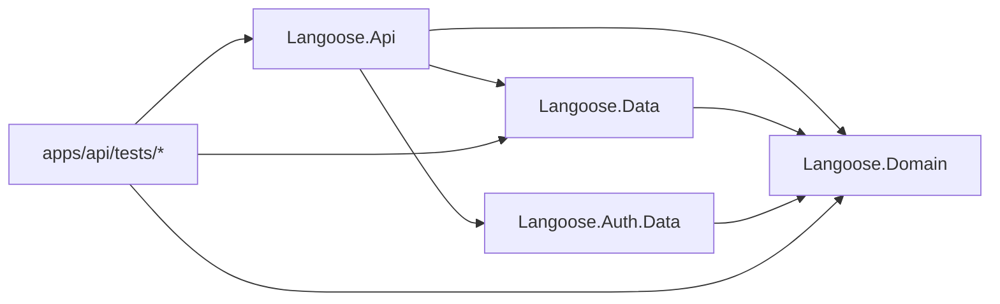

# Langoose Architecture Guidance

## Principle

- Use onion architecture as the mental model.
- Keep it lightweight.
- Avoid ceremony-heavy clean architecture unless the repo truly needs it.

- Keep dependencies pointing inward toward shared business concepts.
- Let API own delivery and orchestration, and let data projects own persistence concerns.
- Add projects only when they create a clearer ownership boundary than the current layout.

## Recommended Shapes

- `API + Data` for modest persistence growth.
- `API + Domain + Data` when core models need a stable shared home outside ASP.NET Core and EF Core.

## Anti-Goals

- Avoid repository-per-entity by default.
- Avoid mediator or CQRS by default.
- Avoid splitting application logic into many thin pass-through layers without a strong reason.
- Avoid making the code harder to trace than the product complexity requires.
