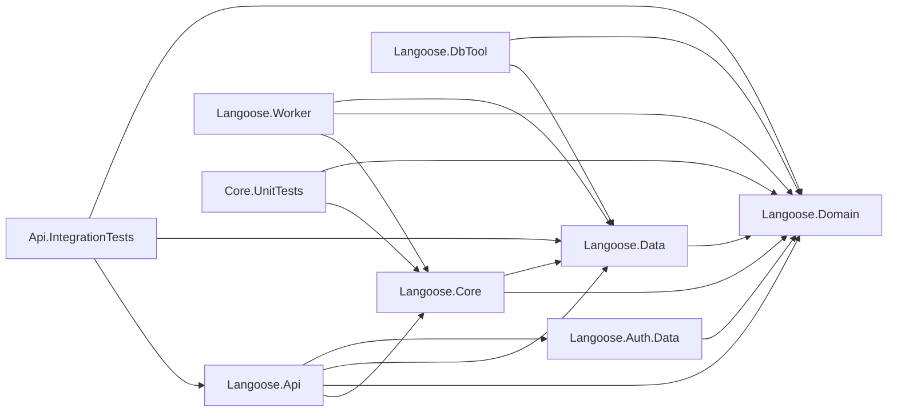

# Langoose Architecture Guidance

## Principle

Use onion architecture. Dependencies point inward: Domain has no dependencies,
everything else depends on Domain directly or transitively.

## Layers

### Domain (innermost)

`apps/api/src/Langoose.Domain/` — no dependencies.

Contains:
- **Entities**: `DictionaryEntry`, `EntryContext`, `UserDictionaryEntry`,
  `UserEntryContext`, `UserProgress`, `StudyEvent`, `ContentFlag`, `ImportRecord`
- **Mapping entities**: `EntryTranslation`, `ContextTranslation` (composite PKs)
- **Enums**: `EnrichmentStatus`, `Source`, `UserEntryStatus`, `ContentOrigin`,
  `StudyVerdict`, `FeedbackCode`
- **Constants**: `ExampleQualityScores`, `ReviewDefaults`
- **Service interfaces**: `IDictionaryService`, `IStudyService`, `IContentService`,
  `IEnrichmentProvider`

Service interfaces use only domain model types — no DTOs.

### Data

`apps/api/src/Langoose.Data/` — depends on Domain.

Contains:
- `AppDbContext` with DbSets for all domain entities
- One `IEntityTypeConfiguration<T>` per entity in `Configurations/`
- Migrations (fresh per major model rework, auto-applied on startup locally)
- Seeding (`DatabaseSeeder`, `SeedDataLoader`, `base-store.json`)

### Core

`apps/api/src/Langoose.Core/` — depends on Domain and Data.

Contains:
- **Services**: `DictionaryService`, `StudyService`, `ContentService`, `EnrichmentService`
  — implement interfaces from Domain
- **Providers**: `LocalEnrichmentProvider`, `GeminiEnrichmentProvider`
  — implement `IEnrichmentProvider` from Domain
- **Utilities**: `TextNormalizer` — static utility, no interface
- **Configuration**: settings classes (`EnrichmentSettings`, `GeminiSettings`,
  `FeaturesSettings`)

Services accept and return domain models. They use `AppDbContext` directly — no
repository-per-entity abstraction.

### Api (presentation)

`apps/api/src/Langoose.Api/` — depends on Core, Domain, Data, Auth.Data.

Contains:
- **Controllers**: thin, map request DTOs → domain models → call service → map
  result → response DTOs
- **Models**: request/response DTOs (only auth DTOs and API-specific shapes)
- **Configuration**: `CorsSettings`, `ForwardedHeadersSettings`
- **Middleware**: `AntiforgeryValidationMiddleware`
- `Program.cs`: DI composition root

Controllers own all DTO ↔ domain model mapping. Services never see DTOs.

### Worker (presentation)

`apps/api/src/Langoose.Worker/` — depends on Core, Domain, Data.

Contains:
- **Services**: `EnrichmentBackgroundService` — polls pending items, enriches in
  batches via `IEnrichmentProvider`
- `Program.cs`: generic host DI composition root
- Own `appsettings.json`

Runs as a separate process. Shares the same database.

### Auth.Data

`apps/api/src/Langoose.Auth.Data/` — depends on Domain. Unchanged by this rework.

### DbTool

`apps/api/src/Langoose.DbTool/` — depends on Data, Domain.
CLI for applying migrations and seeding in hosted environments.

## Anti-Goals

- Avoid repository-per-entity by default.
- Avoid mediator or CQRS by default.
- Avoid splitting logic into thin pass-through layers without a strong reason.
- Avoid putting DTOs in Domain — they belong in the presentation layer.
- Avoid making the code harder to trace than the product complexity requires.
