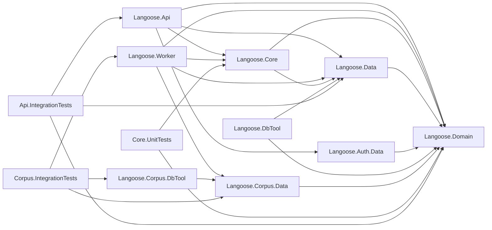

# Langoose Architecture

## Principle

Use onion architecture. Dependencies point inward: Domain has no dependencies,
everything else depends on Domain directly or transitively.

## Solution Layout

`apps/api/Langoose.sln` organises projects with two conventions:

- **Source projects** sit at the root of the solution (no `src` solution
  folder), even though they live on disk under `apps/api/src/`.
- **Test projects** are nested under a `tests` solution folder
  (`NestedProjects` section), matching their on-disk location under
  `apps/api/tests/`.

When adding a new project, do not let `dotnet sln add` create a default
`src` solution folder — it must be removed and the new test project must be
added to the `NestedProjects` section under the existing `tests` folder.

## Layers

### Domain (innermost)

`apps/api/src/Langoose.Domain/` — no dependencies.

Contains:
- **Entities**: `DictionaryEntry`, `EntryContext`, `UserEntry`,
  `UserProgress`, `StudyEvent`, `ContentFlag`, `UserImport`
- **Enums**: `EnrichmentStatus`, `StudyVerdict`, `FeedbackCode`,
  `JobType`, `JobStatus`
- **Constants**: `ProgressDefaults`
- **Service interfaces**: `IDictionaryService`, `IStudyService`, `IContentService`
- **Imports**: `IImportSourceReader` interface + `ImportSourceBundle`
  record — source-agnostic contract for the bulk-import pipeline.
  Each source (wiktionary today, CSV / further corpora later)
  implements the interface in its respective infrastructure project.

Service interfaces use only domain model types — no DTOs.

### Data

`apps/api/src/Langoose.Data/` — depends on Domain.

Contains:
- `AppDbContext` with DbSets for all domain entities
- One `IEntityTypeConfiguration<T>` per entity in `Configurations/`
- Migrations (fresh per major model rework, auto-applied on startup locally)
- Seeding (`DatabaseSeeder`, `SeedDataLoader`, `base-store.json`)

### Core

`apps/api/src/Langoose.Core/` — depends on Domain and Data.

Contains:
- **Services**: `DictionaryService`, `StudyService`, `ContentService`
  — implement interfaces from Domain
- **Providers**: `LocalEnrichmentProvider` — implements `IEnrichmentProvider`
  from Domain. The corpus-based provider is tracked under #92.
- **Heuristic**: `HeuristicFilter` — pure rule-application for the
  corpus-import pipeline. Source-shape parsing lives in the per-source
  `IImportSourceReader` implementation (e.g.
  `Corpus.Data/WiktionaryImportSourceReader`).
- **Utilities**: `TextNormalizer` — static utility, no interface
- **Configuration**: `HeuristicFilterSettings` (consumed by `HeuristicFilter`). Per-job tunables (`UserEntriesImportSettings`, `CorpusImportSettings`) live in Worker — each job owns its own settings (poll interval, batch size, etc.) and passes primitives down to the Core service.

Services accept and return domain models. They use `AppDbContext` directly — no
repository-per-entity abstraction.

The two long-running services follow the same shape — pure
batch-processing logic, no awareness of `background_jobs`. Each call
processes exactly one batch and returns a `BulkJobState` (the unified
per-run state record):
- `UserEntriesImportService` implements `IUserEntriesImportService` — `RunBatchAsync`
  processes one batch of pending user-entry enrichments and returns
  counts. Empty ticks return Total=0 (still recorded by the job for
  liveness).
- `CorpusImportService` implements `ICorpusImportService` — `RunBatchAsync`
  fetches one batch from corpus via `IImportSourceReader`, applies the
  heuristic filter, and returns counts plus the next cursor.

One row in `background_jobs` = one batch run. The Worker side
(`Worker/Jobs/`) owns the row lifecycle: claiming/creating rows,
persisting `BulkJobState` as `ExecutionState`, marking terminal status.
For CorpusImport specifically, after a run completes with non-null
`Cursor`, the job auto-creates a continuation `Pending` row with that
cursor as the next `CorpusImportParams.StartCursor` — the chain
terminates when a run returns `Cursor=null`.

Services know nothing about jobs; jobs know nothing about business logic.

### Api (presentation)

`apps/api/src/Langoose.Api/` — depends on Core, Domain, Data, Auth.Data.

Contains:
- **Controllers**: thin, map request DTOs → domain models → call service → map
  result → response DTOs
- **Models**: request/response DTOs (only auth DTOs and API-specific shapes)
- **Configuration**: `CorsSettings`, `ForwardedHeadersSettings`
- **Middleware**: `AntiforgeryValidationMiddleware`
- `Program.cs`: DI composition root

Controllers own all DTO ↔ domain model mapping. Services never see DTOs.

### Worker (presentation)

`apps/api/src/Langoose.Worker/` — depends on Core, Domain, Data, Corpus.Data.

Contains:
- **Jobs**: per-`JobType` polling loops that dispatch into Core services.
  `UserEntriesImportJob` runs the periodic enrichment loop (gated by the
  `EnableUserEntriesImport` feature flag) and dispatches to `IUserEntriesImportService`.
  `CorpusImportJob` claims operator-submitted `Pending` rows of type
  `CorpusImport` from `background_jobs` and dispatches to `ICorpusImportService`.
  Future AI validation and promotion jobs follow the same shape.
- `Program.cs`: web host DI composition root. Hosts a minimal Kestrel
  listener that exposes `/health` for orchestrator liveness probes; the
  jobs themselves are `IHostedService`s and do all real work.
- Own `appsettings.json`

Runs as a separate process. Shares the same app database; the corpus
database is read-only.

### Auth.Data

`apps/api/src/Langoose.Auth.Data/` — depends on Domain. Unchanged by this rework.

### DbTool

`apps/api/src/Langoose.DbTool/` — depends on Data, Auth.Data, Domain.
CLI for applying migrations, seeding, and managing background jobs
(`submit-bulk-import`, `list-jobs`, `show-job`, `cancel-job`).

### Corpus.Data

`apps/api/src/Langoose.Corpus.Data/` — depends on Domain (for the
`IImportSourceReader` contract); uses Dapper + Npgsql directly. Read-only
access layer for the `langoose_corpus` database. Schema is defined in
embedded SQL files (no EF migrations). Hybrid Postgres + JSONB tables
preserve each source's native shape. Hosts `WiktionaryImportSourceReader`
which implements the Domain `IImportSourceReader` contract for the
bulk-import pipeline.

### Corpus.DbTool

`apps/api/src/Langoose.Corpus.DbTool/` — depends on Corpus.Data.
CLI for initialising the corpus database schema and importing source
files (Kaikki Wiktionary JSONL, etc.) via streaming + bulk COPY.

## Anti-Goals

- Avoid repository-per-entity by default.
- Avoid mediator or CQRS by default.
- Avoid splitting logic into thin pass-through layers without a strong reason.
- Avoid putting DTOs in Domain — they belong in the presentation layer.
- Avoid making the code harder to trace than the product complexity requires.
