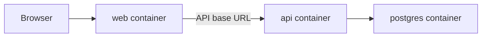

# Langoose Docker Guidance

## Defaults



- Keep the frontend, API, and database as separate runtime concerns.
- Wire the frontend to the API explicitly through environment configuration.
- Persist database state through the database service, not through the API container filesystem.
- Prefer separate images for `apps/api` and `apps/web`.
- Use an SDK image to build/publish the API and a runtime image to run it.
- Decide explicitly between a dev-oriented Vite container and a production-style frontend image.
- Do not copy mutable runtime data or local database state into an image.
- Keep the database as a separate container or external service and persist its data through the database service.
- Expose API and frontend ports explicitly and pass the frontend API base URL through env configuration.
- Use Linux containers unless there is a Windows-specific requirement.
- Use multi-stage Dockerfiles.
- Add `.dockerignore` early.

## E2E Testing

The `e2e` service lives behind a Compose profile and runs Playwright tests against
the containerized app. It depends on both `api` and `web` being healthy.

```
docker compose --profile e2e up --build e2e
```

Use this when validating auth, persistence, or cross-app behavior end to end.

## Review Checklist

- Does the Dockerfile copy only what it needs, in a cache-friendly order?
- Is mutable runtime data excluded from the image?
- Is the frontend API URL explicit and correct for the container network?
- Are Compose dependencies health-aware?
- Are image contexts excluding irrelevant files?

## Sources

- Docker: [Building best practices](https://docs.docker.com/develop/develop-images/dockerfile_best-practices/)
- Docker: [Multi-stage builds](https://docs.docker.com/build/building/multi-stage/)
- Docker: [Control startup order in Compose](https://docs.docker.com/compose/how-tos/startup-order/)
- Microsoft Learn: [Run an ASP.NET Core app in Docker containers](https://learn.microsoft.com/en-us/aspnet/core/host-and-deploy/docker/building-net-docker-images?view=aspnetcore-10.0)
