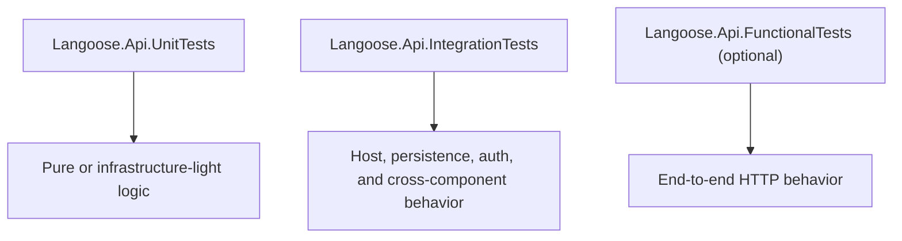

# Langoose .NET Test Layout

## Current Shape

- Keep test boundaries organized by what kind of risk they prove.
- Add a third test layer only when unit and integration tests are no longer enough.
- Avoid rebuilding a catch-all suite that blurs these responsibilities.
- `apps/api/src/Langoose.Api/Langoose.Api.csproj`
- `apps/api/tests/Langoose.Api.UnitTests/Langoose.Api.UnitTests.csproj`
- `apps/api/tests/Langoose.Api.IntegrationTests/Langoose.Api.IntegrationTests.csproj`

## Boundary Rules

- Keep unit tests focused on infrastructure-light logic.
- Keep integration tests for persistence, host, auth, and cross-component behavior.
- Add `Langoose.Api.FunctionalTests` only if a third boundary becomes useful.
- If a test mainly proves isolated logic, a lightweight incidental dependency on framework objects does not automatically force it upward into integration.

## Internal Organization

- Group tests by feature or application area.
- Use clear test names that describe method, scenario, and expected behavior.
- Keep application references one-way: test projects reference app projects.

## Repo-Specific Notes

- Integration tests can still be split internally by `Api` and `Services`.
- Keep `Api` integration tests for request-pipeline, auth, antiforgery, routing, and serialization behavior.
- Keep `Services` integration tests for EF-backed backend behavior where HTTP is not the primary risk.
- Do not add persistence-only tests unless they prove something the broader integration tests do not already prove.
