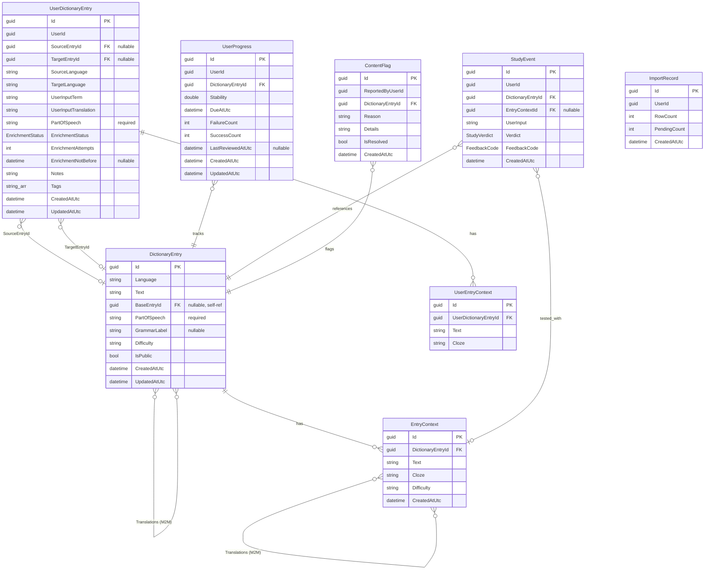

# Domain Model

This document describes the data model for Langoose. All entities live in
`Langoose.Domain/Models/` and use `Guid` primary keys generated with
`Guid.CreateVersion7()` (time-ordered for efficient B-tree indexing).
Translation links use EF Core implicit many-to-many (no explicit join entities).

## Entity Relationship Diagram

## Entities

### DictionaryEntry

A word or word form in any language. Base forms (lemmas) and derived forms
(inflections, cases, tenses) live in the same table, linked by `BaseEntryId`.
Base forms have `BaseEntryId = null`.

| Field | Type | Notes |
|-------|------|-------|
| Id | Guid v7 | Primary key |
| Language | string | Language code (e.g., "en", "ru") |
| Text | string | The word or form (e.g., "book", "booked", "книга", "книгу") |
| BaseEntryId | Guid? | FK to self. Null for base forms, points to lemma for derived forms. |
| PartOfSpeech | string | Required. "noun", "verb", "phrase", etc. |
| GrammarLabel | string? | Inflection info for derived forms: "past simple", "plural", "accusative". Null for base forms. |
| Difficulty | string? | General difficulty (A1–B2) |
| IsPublic | bool | `true` for curated base items, `false` for user-contributed until validated |
| CreatedAtUtc | DateTimeOffset | |
| UpdatedAtUtc | DateTimeOffset | |

**Translations** — implicit M2M navigation (`ICollection<DictionaryEntry>`) links
base forms across languages. Stored unidirectionally (source → target).
These provide the word-level glosses shown on study cards.
Join table: `dictionary_entries_translations (source_id, target_id)`.

Indexed on `(Language, Text, PartOfSpeech)`.

Examples:
- `("en", "book", null, null)` — base form
- `("en", "booked", →book, "past simple")` — derived form
- `("ru", "книга", null, null)` — base form
- `("ru", "книгу", →книга, "accusative")` — derived form

Derived forms serve two purposes:
1. **Dedup lookup** — user types "книгу" → find entry → follow BaseEntryId → found
2. **Context linking** — EntryContext links to the specific form, so ExpectedAnswer
   and GrammarHint are derived from the entry rather than stored on the context

### EntryContext

A learning context for a specific entry form. Contains a sentence with a cloze gap.
The expected answer and grammar hint are derived from the linked DictionaryEntry.

| Field | Type | Notes |
|-------|------|-------|
| Id | Guid v7 | |
| DictionaryEntryId | Guid | FK to DictionaryEntry (the specific form being tested) |
| Text | string | Full sentence (e.g., "She booked the room yesterday.") |
| Cloze | string | Sentence with gap (e.g., "She ____ the room yesterday.") |
| Difficulty | string? | Per-context difficulty (A1–B2) |
| CreatedAtUtc | DateTimeOffset | |

**Translations** — implicit M2M navigation (`ICollection<EntryContext>`) links
paired contexts across languages.
Join table: `entry_contexts_translations (source_id, target_id)`.

A base entry typically has 1–3 contexts across its forms, providing variety for
study card rotation.

**Derived fields** (not stored, computed at query time):
- `ExpectedAnswer` = linked DictionaryEntry.Text
- `GrammarHint` = combined from DictionaryEntry.PartOfSpeech and GrammarLabel

### UserDictionaryEntry

A per-user dictionary entry. Owns the enrichment lifecycle (pending/failed state).

| Field | Type | Notes |
|-------|------|-------|
| Id | Guid v7 | |
| UserId | Guid | |
| SourceEntryId | Guid? | FK to source-language DictionaryEntry base form. Null while pending. |
| TargetEntryId | Guid? | FK to target-language DictionaryEntry base form. Null while pending. |
| SourceLanguage | string | User's native language (e.g., "ru") |
| TargetLanguage | string | Learning language (e.g., "en") |
| UserInputTerm | string | What the user typed as the word |
| UserInputTranslation | string? | What the user typed as the translation |
| PartOfSpeech | string | Required. Set by user on input. |
| EnrichmentStatus | enum | Pending, Enriched, InvalidSource, InvalidTarget, InvalidLink, ProviderError |
| EnrichmentAttempts | int | Retry counter |
| EnrichmentNotBefore | DateTimeOffset? | Backoff scheduling |
| Notes | string? | User's private notes |
| Tags | string[] | User's private tags |
| CreatedAtUtc | DateTimeOffset | |
| UpdatedAtUtc | DateTimeOffset | |

When enrichment succeeds, DictionaryEntries are created (or found),
`SourceEntryId` and `TargetEntryId` are set via navigation properties,
and status becomes `Enriched`. Terminal validation failures set
`InvalidSource`, `InvalidTarget`, or `InvalidLink`. Transient provider
failures retry with exponential backoff; `ProviderError` after max retries.

### UserEntryContext

A private learning context created by the user. Linked to UserDictionaryEntry.

| Field | Type | Notes |
|-------|------|-------|
| Id | Guid v7 | |
| UserDictionaryEntryId | Guid | FK to UserDictionaryEntry |
| Text | string | Full sentence |
| Cloze | string | Sentence with gap |

### UserProgress

Spaced repetition state per (user, dictionary entry). Created lazily when a
DictionaryEntry first appears in a user's study session.

| Field | Type | Notes |
|-------|------|-------|
| Id | Guid v7 | |
| UserId | Guid | |
| DictionaryEntryId | Guid | FK to DictionaryEntry (base form) |
| Stability | double? | Affects rescheduling interval |
| DueAtUtc | DateTimeOffset | When the item is next due |
| FailureCount | int | Incorrect answer count |
| SuccessCount | int | Correct/almost-correct count |
| LastReviewedAtUtc | DateTimeOffset? | |
| CreatedAtUtc | DateTimeOffset | |
| UpdatedAtUtc | DateTimeOffset | |

Unique constraint on `(UserId, DictionaryEntryId)`.

### StudyEvent

Records each answer attempt for analytics and history.

| Field | Type | Notes |
|-------|------|-------|
| Id | Guid v7 | |
| UserId | Guid | |
| DictionaryEntryId | Guid | FK to DictionaryEntry |
| EntryContextId | Guid? | FK to EntryContext (which context was tested) |
| UserInput | string | What the user typed |
| Verdict | enum | `Correct`, `AlmostCorrect`, `Incorrect` |
| FeedbackCode | enum | `ExactMatch`, `MinorTypo`, `MeaningMismatch`, etc. |
| CreatedAtUtc | DateTimeOffset | |

### ContentFlag

Reports quality issues with shared content.

| Field | Type | Notes |
|-------|------|-------|
| Id | Guid v7 | |
| ReportedByUserId | Guid | |
| DictionaryEntryId | Guid | FK to DictionaryEntry |
| Reason | string | |
| Details | string? | |
| IsResolved | bool | |
| CreatedAtUtc | DateTimeOffset | |

### ImportRecord

Tracks CSV import history.

| Field | Type | Notes |
|-------|------|-------|
| Id | Guid v7 | |
| UserId | Guid | |
| RowCount | int | Total rows in CSV |
| PendingCount | int | Items pending enrichment |
| CreatedAtUtc | DateTimeOffset | |

## Enums

| Enum | Values | Used on |
|------|--------|---------|
| EnrichmentStatus | Pending, Enriched, Failed | UserDictionaryEntry |
| StudyVerdict | Correct, AlmostCorrect, Incorrect | StudyEvent |
| FeedbackCode | ExactMatch, AcceptedVariant, MissingArticle, InflectionMismatch, MinorTypo, MeaningMismatch | StudyEvent |

## Key Indexes

| Table | Index | Purpose |
|-------|-------|---------|
| DictionaryEntry | `(Language, Text)` | Fast lookup by word |
| DictionaryEntry | `BaseEntryId` | Find all forms of a base entry |
| EntryContext | `DictionaryEntryId` | Find contexts for an entry |
| UserDictionaryEntry | `(UserId, DictionaryEntryId)` | User's dictionary + dedup |
| UserDictionaryEntry | `(EnrichmentStatus, CreatedAtUtc)` | Worker polling |
| UserProgress | Unique `(UserId, DictionaryEntryId)` | One progress per user per entry |
| StudyEvent | `(UserId, CreatedAtUtc)` | Dashboard daily count |
