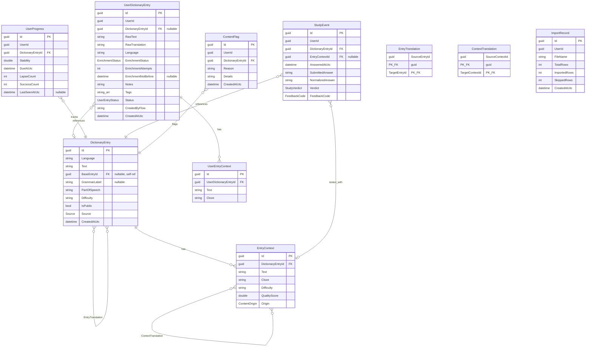

# Domain Model

This document describes the data model for Langoose. All entities live in
`Langoose.Domain/Models/` and use `Guid` primary keys generated with
`Guid.CreateVersion7()` (time-ordered for efficient B-tree indexing).
Mapping tables use composite primary keys instead of surrogate IDs.

## Entity Relationship Diagram

## Entities

### DictionaryEntry

A word or word form in any language. Base forms (lemmas) and derived forms
(inflections, cases, tenses) live in the same table, linked by `BaseEntryId`.

| Field | Type | Notes |
|-------|------|-------|
| Id | Guid v7 | Primary key |
| Language | string | Language code (e.g., "en", "ru") |
| Text | string | The word or form (e.g., "book", "booked", "книга", "книгу") |
| BaseEntryId | Guid? | FK to self. Null for base forms, points to lemma for derived forms. |
| GrammarLabel | string? | Grammar description of this form: "past simple", "plural", "accusative". Null for base forms. |
| PartOfSpeech | string | "noun", "verb", "phrase", etc. Meaningful on base forms. |
| Difficulty | string | General difficulty (A1–B2) |
| IsPublic | bool | `true` for curated base items, `false` for user-contributed until validated |
| Source | enum | `Base` (curated) or `UserContributed` |
| CreatedAtUtc | DateTimeOffset | |

Indexed on `(Language, Text)`.

Examples:
- `("en", "book", null, null, "verb")` — base form
- `("en", "booked", →book, "past simple", "verb")` — derived form
- `("en", "books", →book, "plural", "noun")` — derived form
- `("ru", "книга", null, null, "noun")` — base form
- `("ru", "книгу", →книга, "accusative", "noun")` — derived form

"book" as a noun and "book" as a verb are separate base entries (different
PartOfSpeech).

Derived forms serve two purposes:
1. **Dedup lookup** — user types "книгу" → find entry → follow BaseEntryId → found
2. **Context linking** — EntryContext links to the specific form, so ExpectedAnswer
   and GrammarHint are derived from the entry rather than stored on the context

### EntryTranslation

Links base forms across languages as word-level translation hints. Stored in both
directions for simple querying.

| Field | Type | Notes |
|-------|------|-------|
| SourceEntryId | Guid | FK to DictionaryEntry (base form) |
| TargetEntryId | Guid | FK to DictionaryEntry (base form) |

PK: `(SourceEntryId, TargetEntryId)`. Stored bidirectionally — if (A→B) exists,
(B→A) also exists.

Examples:
- ("book" en verb) ↔ ("забронировать" ru)
- ("book" en noun) ↔ ("книга" ru)
- ("book" en noun) ↔ ("книжка" ru)

These provide the word-level glosses shown on study cards regardless of which
specific context is being tested.

### EntryContext

A learning context for a specific entry form. Contains an English (or any language)
sentence with a cloze gap. The expected answer and grammar hint are derived from the
linked DictionaryEntry.

| Field | Type | Notes |
|-------|------|-------|
| Id | Guid v7 | |
| DictionaryEntryId | Guid | FK to DictionaryEntry (the specific form being tested) |
| Text | string | Full sentence (e.g., "She booked the room yesterday.") |
| Cloze | string | Sentence with gap (e.g., "She ____ the room yesterday.") |
| Difficulty | string | Per-context difficulty (A1–B2) |
| QualityScore | double | Content quality score |
| Origin | enum | `Dataset` (curated) or `Ai` (generated) |

A base entry typically has 1–3 contexts across its forms, providing variety for
study card rotation.

**Derived fields** (not stored, computed at query time):
- `ExpectedAnswer` = linked DictionaryEntry.Text
- `GrammarHint` = linked DictionaryEntry.GrammarLabel

### ContextTranslation

Links two EntryContexts that are translations of the same sentence. Same pattern
as EntryTranslation — stored bidirectionally.

| Field | Type | Notes |
|-------|------|-------|
| SourceContextId | Guid | FK to EntryContext |
| TargetContextId | Guid | FK to EntryContext |

PK: `(SourceContextId, TargetContextId)`.

Example:
- EntryContext("She booked the room.", linked to "booked" en)
  ↔ EntryContext("Она забронировала комнату.", linked to "забронировала" ru)

When studying English, the English context's Cloze is shown and the Russian
context's Text is the sentence-level hint. When studying Russian (future), the
roles reverse.

### UserDictionaryEntry

A per-user dictionary entry. Owns the enrichment lifecycle (pending/failed state).

| Field | Type | Notes |
|-------|------|-------|
| Id | Guid v7 | |
| UserId | Guid | |
| DictionaryEntryId | Guid? | FK to DictionaryEntry. Null while pending enrichment. |
| RawText | string | What the user typed as the word |
| RawTranslation | string | What the user typed as the translation |
| Language | string | Target language (e.g., "ru") |
| EnrichmentStatus | enum | `Pending`, `Enriched`, or `Failed` |
| EnrichmentAttempts | int | Retry counter |
| EnrichmentNotBefore | DateTimeOffset? | Backoff scheduling |
| Notes | string | User's private notes |
| Tags | string[] | User's private tags |
| Status | enum | `Active` or `Archived` |
| CreatedByFlow | string | "quick-add", "csv-import" |
| CreatedAtUtc | DateTimeOffset | |

When enrichment succeeds, a DictionaryEntry is created (or found),
`DictionaryEntryId` is set, and status becomes `Enriched`. When enrichment fails
after max retries, the item is marked `Failed` and `DictionaryEntryId` stays null.

### UserEntryContext

A private learning context created by the user. Linked to UserDictionaryEntry.

| Field | Type | Notes |
|-------|------|-------|
| Id | Guid v7 | |
| UserDictionaryEntryId | Guid | FK to UserDictionaryEntry |
| Text | string | Full sentence |
| Cloze | string | Sentence with gap |

User contexts can also have translations via the same ContextTranslation pattern
if the user provides them.

### UserProgress

Spaced repetition state per (user, dictionary entry). Created lazily when a
DictionaryEntry first appears in a user's study session.

| Field | Type | Notes |
|-------|------|-------|
| Id | Guid v7 | |
| UserId | Guid | |
| DictionaryEntryId | Guid | FK to DictionaryEntry (base form) |
| Stability | double | Affects rescheduling interval |
| DueAtUtc | DateTimeOffset | When the item is next due |
| LapseCount | int | Incorrect answer count |
| SuccessCount | int | Correct/almost-correct count |
| LastSeenAtUtc | DateTimeOffset? | |

Unique constraint on `(UserId, DictionaryEntryId)`.

### StudyEvent

Records each answer attempt for analytics and history.

| Field | Type | Notes |
|-------|------|-------|
| Id | Guid v7 | |
| UserId | Guid | |
| DictionaryEntryId | Guid | FK to DictionaryEntry |
| EntryContextId | Guid? | FK to EntryContext (which context was tested) |
| AnsweredAtUtc | DateTimeOffset | |
| SubmittedAnswer | string | |
| NormalizedAnswer | string | |
| Verdict | enum | `Correct`, `AlmostCorrect`, `Incorrect` |
| FeedbackCode | enum | `ExactMatch`, `MinorTypo`, `MeaningMismatch`, etc. |

### ContentFlag

Reports quality issues with shared content.

| Field | Type | Notes |
|-------|------|-------|
| Id | Guid v7 | |
| UserId | Guid | |
| DictionaryEntryId | Guid | FK to DictionaryEntry |
| Reason | string | |
| Details | string | |
| CreatedAtUtc | DateTimeOffset | |

### ImportRecord

Tracks CSV import history (file name, row counts, timestamps).

## Enums

| Enum | Values | Used on |
|------|--------|---------|
| EnrichmentStatus | Pending, Enriched, Failed | UserDictionaryEntry |
| Source | Base, UserContributed | DictionaryEntry |
| UserEntryStatus | Active, Archived | UserDictionaryEntry |
| ContentOrigin | Dataset, Ai | EntryContext |
| StudyVerdict | Correct, AlmostCorrect, Incorrect | StudyEvent |
| FeedbackCode | ExactMatch, AcceptedVariant, MissingArticle, InflectionMismatch, MinorTypo, MeaningMismatch | StudyEvent |

## Key Indexes

| Table | Index | Purpose |
|-------|-------|---------|
| DictionaryEntry | `(Language, Text)` | Fast lookup by word |
| DictionaryEntry | `BaseEntryId` | Find all forms of a base entry |
| EntryTranslation | PK `(SourceEntryId, TargetEntryId)` | Translation lookup |
| EntryContext | `DictionaryEntryId` | Find contexts for an entry |
| ContextTranslation | PK `(SourceContextId, TargetContextId)` | Context translation lookup |
| UserDictionaryEntry | `UserId` | User's dictionary |
| UserDictionaryEntry | `EnrichmentStatus` | Worker polling |
| UserProgress | Unique `(UserId, DictionaryEntryId)` | One progress per user per entry |
